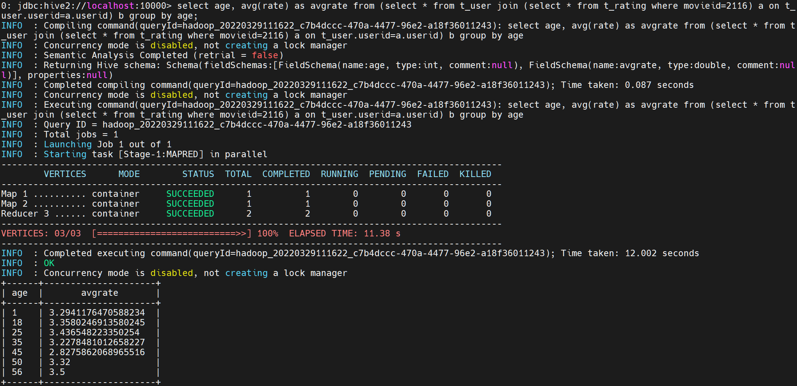
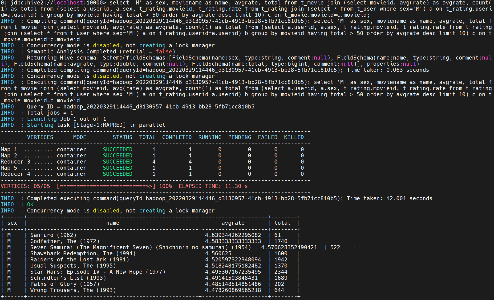
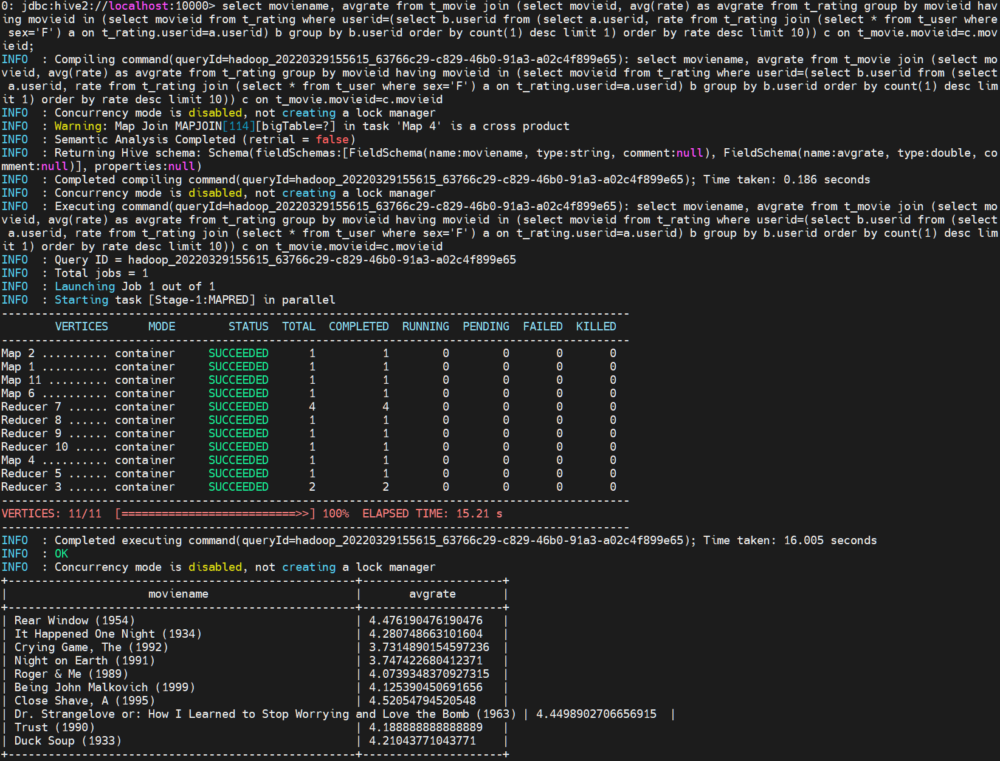

# hive

* 题目一：展示电影 ID 为 2116 这部电影各年龄段的平均影评分。

```sql
select age, avg(rate) as avgrate from (select * from t_user join (select * from t_rating where movieid=2116) a on t_user.userid=a.userid) b group by age;
```

执行截图：




* 题目二：找出男性评分最高且评分次数超过 50 次的 10 部电影，展示电影名，平均影评分和评分次数。

```sql
select 'M' as sex, moviename as name, avgrate, total from t_movie join (select movieid, avg(rate) as avgrate, count(1) as total from (select a.userid, a.sex, t_rating.movieid, t_rating.rate from t_rating join (select * from t_user where sex='M') a on t_rating.userid=a.userid) b group by movieid having total > 50 order by avgrate desc limit 10) c on t_movie.movieid=c.movieid;
```

执行截图：



* 题目三：找出影评次数最多的女士所给出最高分的 10 部电影的平均影评分，展示电影名和平均影评分（可使用多行 SQL）。

```sql
select moviename, avgrate from t_movie join (select movieid, avg(rate) as avgrate from t_rating group by movieid having movieid in (select movieid from t_rating where userid=(select b.userid from (select a.userid, rate from t_rating join (select * from t_user where sex='F') a on t_rating.userid=a.userid) b group by b.userid order by count(1) desc limit 1) order by rate desc limit 10)) c on t_movie.movieid=c.movieid;
```

执行截图：



